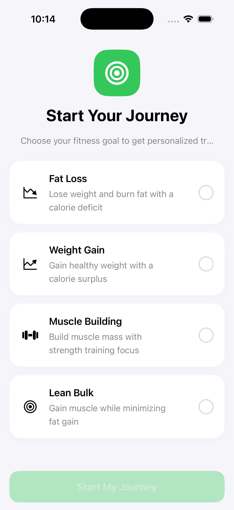
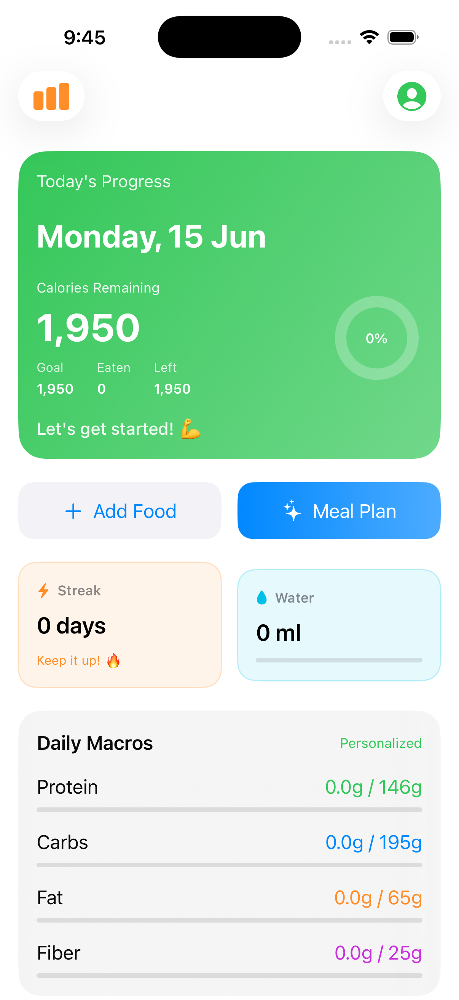
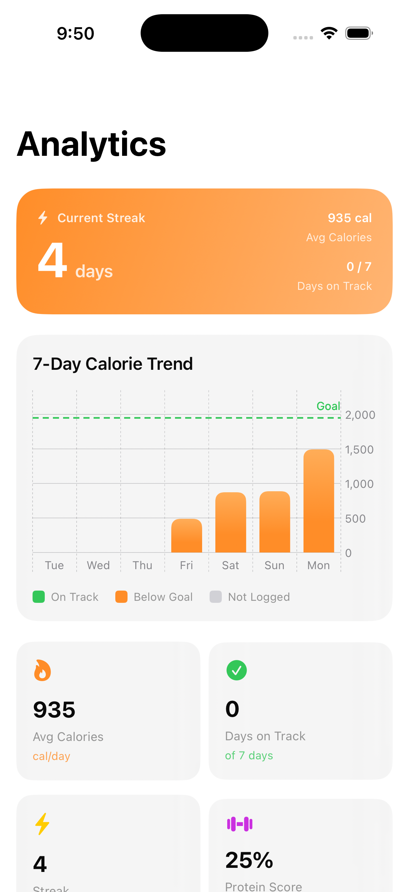
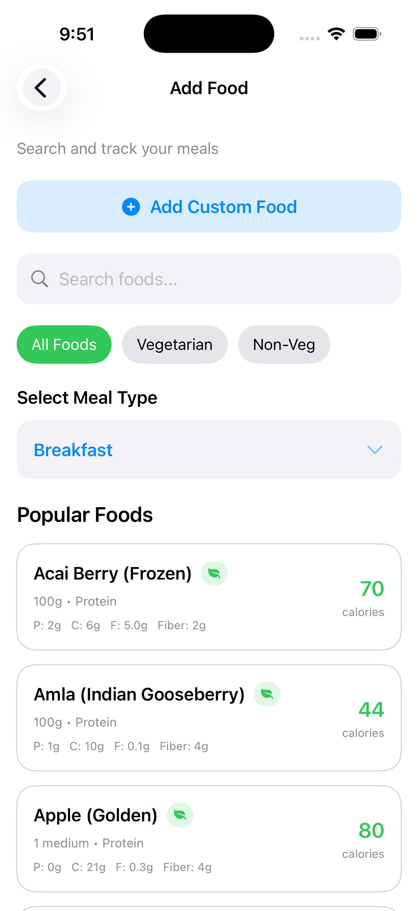
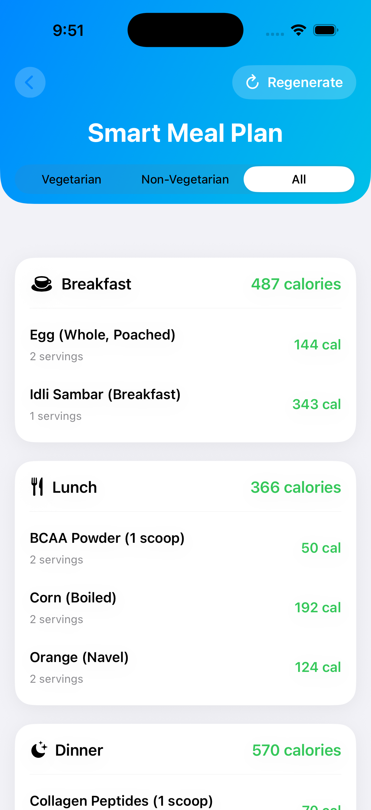
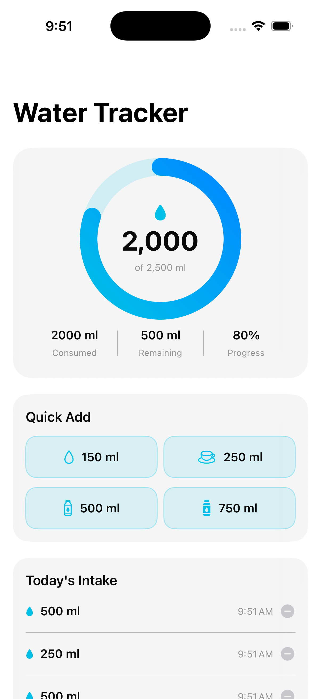
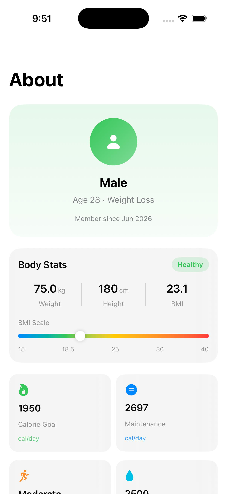

# 🧭 NutriPilot

NutriPilot is a modern, premium SwiftUI application designed to make nutrition tracking simple, elegant, and insightful. Built with a focus on rich aesthetics, smooth animations, and a responsive glassmorphic UI, NutriPilot helps users achieve their weight goals through smart meal planning, active hydration tracking, and detailed calorie and macro analytics.

---

## 📱 Screenshots

<div align="center">
  <table border="0">
    <tr>
      <td align="center"><b>Onboarding Screen</b></td>
      <td align="center"><b>Dashboard</b></td>
      <td align="center"><b>Detailed Analytics</b></td>
    </tr>
    <tr>
      <td valign="top" width="33%"></td>
      <td valign="top" width="33%"></td>
      <td valign="top" width="33%"></td>
    </tr>
    <tr>
      <td align="center"><b>Add Food Screen</b></td>
      <td align="center"><b>Smart Meal Planner</b></td>
      <td align="center"><b>Water Tracker</b></td>
    </tr>
    <tr>
      <td valign="top" width="33%"></td>
      <td valign="top" width="33%"></td>
      <td valign="top" width="33%"></td>
    </tr>
    <tr>
      <td align="center" colspan="3"><b>User Profile</b></td>
    </tr>
    <tr>
      <td align="center" colspan="3"></td>
    </tr>
  </table>
</div>

---

## ✨ Features

- **🎯 Smart Onboarding & Goal Setting**
  - Interactive onboarding flows that calculate maintenance and target calories using the **Mifflin-St Jeor** equation.
  - Dynamically calculates goals based on age, height, weight, gender, and weekly activity levels (Low, Moderate, High).

- **📊 Modern Progress Dashboard**
  - **Glassmorphic UI** featuring active remaining calorie rings, color-coded macro tracking bars (Protein, Carbs, Fat, Fiber), and streak widgets.
  - **Smart Tip Engine**: An intelligence system that analyzes logged food and macros to give real-time nutritional tips.
  - **Motivational Engine**: Dynamic messages that adapt to daily calorie targets to keep you motivated.

- **🥗 Smart Meal Planner**
  - An intelligent local generator that constructs optimized meal recommendations for Breakfast, Lunch, Dinner, and Snacks based on diet preferences (Vegetarian, Non-Vegetarian, All) and remaining caloric targets.

- **📈 Deep Analytics & Trend Charts**
  - Beautiful calorie trends visualized using **Swift Charts** showcasing goal offsets.
  - H-Index & protein consistency rings tracking how often you hit macro targets over a rolling 7-day period.

- **💧 Hydration Tracker**
  - Cyan-ring progress gauge with quick presets (150ml Sip, 250ml Glass, 500ml Bottle, 750ml Canteen) and logs history entries with swipe-to-delete.

- **🔍 Comprehensive Food Logger**
  - Pre-populated local database spanning essential ingredients.
  - Filtering by vegetarian status and custom serving multipliers.
  - Support for creating custom food logs.

---

## 🛠️ Architecture

NutriPilot uses modern iOS design patterns and frameworks to keep the app lightweight, performant, and robust:

- **State Management**: Built using the native `@Observable` macro (available in iOS 17+) injected as an environment state.
- **Single Source of Truth**: `AppState` coordinates all actions (adding food, deleting food, tracking water, updating profile metrics) and manages global aggregates.
- **Domain Decoupling**: Algorithms and computational logic are segregated into testable engine files:
  - `SmartMealPlanner.swift` handles recommendation algorithms.
  - `NutritionTipEngine.swift` generates smart feedback on macros.
  - `AnalyticsEngine.swift` manages streak tracking and weekly consistency aggregates.
- **Storage Layer**: Transparent JSON persistence inside `UserDefaults` via standard `Codable` compliance, allowing immediate offline support.

---

## 🚀 Getting Started

### Prerequisites
- Xcode 15.0 or newer
- macOS Sonoma (14.0) or newer
- iOS 17.0+ Simulator or physical device

### Installation
1. Clone the repository to your local machine:
   ```bash
   git clone https://github.com/yourusername/NutriPilot.git
   ```
2. Open the project in Xcode:
   ```bash
   open NutriPilot.xcodeproj
   ```
3. Select your target device (e.g., iPhone 15 simulator or your local iPhone).
4. Run/Build the application:
   - Command: `Cmd + R` in Xcode.

---

## 🧬 Technology Stack
- **Framework**: SwiftUI (iOS 17+)
- **Charts**: Swift Charts
- **Data Persistence**: UserDefaults + JSON Codable
- **Design Pattern**: MVVM + Container State Pattern (via `@Observable`)
